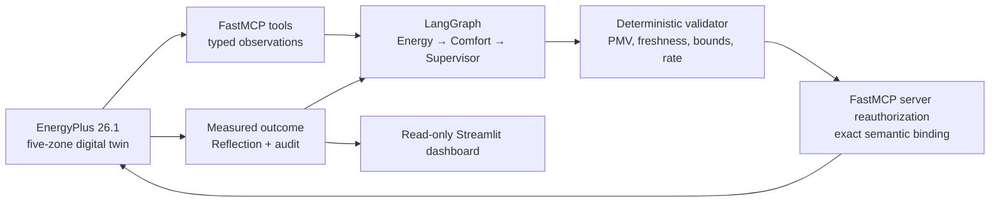

# Eco-Loop Building Agents

Eco-Loop is a physics-grounded, PMV-aware building control system. EnergyPlus 26.1
simulates a five-zone New Delhi building while a typed LangGraph workflow coordinates
Energy, Comfort, Supervisor, and Reflection roles. Every proposed cooling-setpoint
change crosses a deterministic safety validator and a server-side FastMCP
reauthorization boundary before it can reach the EnergyPlus actuator.

## Verified result

The immutable accepted run is `controlled-run001-optimized-v3`, simulated for May 23–29
with New Delhi Safdarjung weather:

| Metric | Fixed baseline | Eco-Loop | Change |
|---|---:|---:|---:|
| HVAC electricity | 40.3306 kWh | 33.8408 kWh | **16.0914% saved** |
| Occupied PMV compliance `[-0.5, +0.5]` | 76.00% | **90.64%** | +14.64 pp |
| Emergency PMV violations | 5 | 5 | no increase |
| Applied decisions | — | 168/168 | 100% autonomy |

EnergyPlus completed all 672 timesteps with zero severe errors. All 168 setpoints were
inside `22–28°C`, adjacent changes were at most `1°C`, and the approved-action gap was
zero minutes. Compact verified outputs are committed under
[`artifacts/accepted-run`](artifacts/accepted-run); the complete local evidence record is
[`evidence/run001/verification.v1.json`](evidence/run001/verification.v1.json).

## Architecture



The local Qwen3 4B provider is supported, schema-constrained, sequential, and advisory.
The accepted result uses the typed deterministic optimizer mode because its output is
reproducible under the hackathon CPU deadline. Model failure or timeout routes to
deterministic PMV-aware control; it never grants the model actuator authority. See
[`docs/architecture.md`](docs/architecture.md) for trust boundaries and design novelty.

## Prerequisites

- Windows with Python 3.12 and [`uv`](https://docs.astral.sh/uv/)
- EnergyPlus 26.1.0
- New Delhi Safdarjung TMYx 2011–2025 weather
- Ollama 0.32+ with `qwen3:4b-instruct` only for local-LLM mode

Weather provenance, download URL, and SHA-256 are documented in
[`docs/model-preparation.md`](docs/model-preparation.md). Large runtimes, model weights,
weather downloads, and generated runs are intentionally excluded from Git.

## Setup

```powershell
git clone https://github.com/gokulan21/eco-loop-building-agents-hcl.git
cd eco-loop-building-agents-hcl
uv sync --locked --all-extras
Copy-Item .env.example .env
.\.venv\Scripts\python.exe -m bms_agent.cli doctor --json
```

Place the verified `.epw`, `.ddy`, and `.stat` files in `weather/`. If EnergyPlus is not
on `PATH`, set `ENERGYPLUS_HOME` in `.env` or use the documented project-local layout.

Prepare the pinned official model:

```powershell
.\.venv\Scripts\python.exe -m bms_agent.simulation.model_prep
```

## Run the experiment

Create the fixed-schedule baseline:

```powershell
.\.venv\Scripts\python.exe -m bms_agent.cli run-baseline --json
```

Run the complete reproducible three-role closed loop:

```powershell
.\.venv\Scripts\python.exe scripts\run_controlled_experiment.py `
  --run-id my-controlled-run `
  --mode deterministic-optimizer
```

To exercise Qwen with the same deterministic safety and fallback boundary, use
`--mode local-llm`. Run IDs are immutable; reuse fails safely without overwriting prior
evidence.

## Open the dashboard

```powershell
.\.venv\Scripts\python.exe -m streamlit run src\bms_agent\dashboard\app.py
```

The default **Results** view is read-only and shows exact judging KPIs, PMV with the
target band, zone temperatures, applied setpoint, cumulative baseline/control energy,
structured role outputs, and all timestamped decision/reflection outcomes.

The separate **Live Scenario Lab** lets a user change outdoor temperature, occupancy,
PMV disturbance, starting temperature, setpoint, and advisory provider, then run the
LangGraph Energy → Comfort → Supervisor → Safety → Action → Reflection process one
step at a time. It is an explicitly labeled reduced-order demonstration sandbox: it
cannot write EnergyPlus, MCP sessions, real equipment, or accepted-run artifacts.

## Quality gate

```powershell
uv lock --check
.\.venv\Scripts\python.exe -m ruff check .
.\.venv\Scripts\python.exe -m pyright
.\.venv\Scripts\python.exe -m pytest -q
```

Final verified gate: **377 tests passed at 90.47% branch coverage**, Ruff clean, Pyright
zero errors, locked environment resolved 92 packages, and an unattended seven-day
rehearsal exactly reproduced the accepted result.

## Documentation

- [`docs/technical-document.md`](docs/technical-document.md): complete system, SRS,
  architecture, module, workflow, safety, data, testing, operation, and results guide
- [`docs/architecture.md`](docs/architecture.md): architecture, novelty, and trust model
- [`docs/techspec.md`](docs/techspec.md): requirements, contracts, and acceptance tests
- [`docs/demo-guide.md`](docs/demo-guide.md): three-minute demonstration sequence
- [`docs/safety-log.md`](docs/safety-log.md): append-only safety findings and mitigations
- [`docs/current-status.md`](docs/current-status.md): current delivery state
- [`docs/submission-manifest.md`](docs/submission-manifest.md): deliverable inventory

## License

MIT — see [`LICENSE`](LICENSE).
