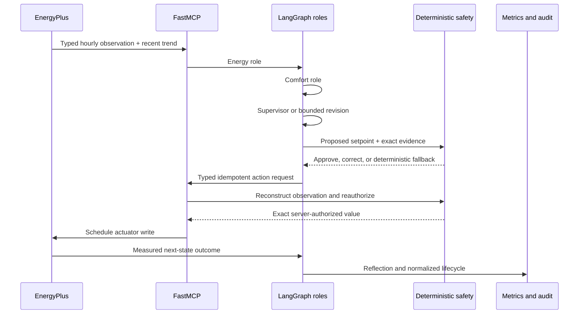

# Eco-Loop Architecture and Novelty

## Objective

Eco-Loop minimizes HVAC electricity without trading away occupied comfort. The
proof-of-concept controls one shared cooling schedule in EnergyPlus over a seven-day New
Delhi summer period. The primary comfort target is occupied Fanger PMV
`[-0.5, +0.5]`; emergency bounds are `[-1.0, +1.0]`.

## Closed-loop design

The graph makes process state explicit: initialize, observe, Energy, Comfort,
Supervisor, validate, revise/fallback, apply, evaluate, reflect, continue/finish, and
safe abort. Checkpointed state is bound to a run ID, decision ID, observation sequence,
and a monotonic action deadline.

## Trust hierarchy

1. EnergyPlus is the physical source of truth.
2. Deterministic safety policy owns PMV meaning, complete/finite data, identity,
   freshness, setpoint bounds, rate limits, and hot/cold direction.
3. FastMCP reconstructs the current observation and independently reauthorizes the exact
   requested value. A client-side “approved” claim is insufficient.
4. LangGraph coordinates bounded roles and fallback, but does not access the actuator.
5. Qwen or deterministic role providers are advisory; neither can bypass levels 2–3.
6. Streamlit's Results view is read-only. Its separate Live Scenario Lab runs an
   in-memory reduced-order LangGraph demonstration and cannot start, stop, or mutate an
   EnergyPlus/MCP run or accepted artifact.

## What is novel

- **Comfort-constrained optimization, not energy-only control.** The accepted run saves
  16.09% HVAC electricity while raising occupied PMV compliance from 76.00% to 90.64%.
- **Multi-agent reasoning as an inspectable state machine.** Energy, Comfort,
  Supervisor, and Reflection remain distinct typed responsibilities, with explicit
  revision and failure routes rather than an opaque loop.
- **Double authorization at the physical boundary.** The MCP server does not trust the
  graph's validation record. It independently recomputes semantic authorization against
  its own latest observation and writes only the exact bound value.
- **Deadline-aware local AI.** All three roles share one monotonic deadline. Slow,
  malformed, or unavailable local inference abstains into deterministic PMV-aware
  control instead of stalling the building.
- **Evidence-first autonomy.** Immutable run IDs, idempotency keys, correlated
  observation/decision records, normalized errors, and no-overwrite exports make every
  result reproducible and reviewable.
- **Safety learned through adversarial verification.** Independent tests exercised
  stale identity, missing units, substituted actions, prompt contamination, deadline
  overruns, ghost audit events, duplicate persistence, and terminal lifecycle edges.

## Accepted experiment

- Location/run period: New Delhi Safdarjung, May 23–29.
- Model: pinned EnergyPlus `5ZoneAirCooled.idf`, five Fanger-enabled occupied zones.
- Timestep/control: 15-minute physics, hourly decision boundary.
- Baseline: fixed official cooling schedule.
- Controlled provider: typed deterministic optimizer through the identical LangGraph,
  validator, FastMCP, actuator, reflection, and audit path.
- Local-LLM mode: Qwen3 4B structured provider with an 8-second attempt timeout,
  64-token cap, one correction, and deterministic fallback.

## Measured outcome

| Measure | Baseline | Controlled |
|---|---:|---:|
| HVAC electricity | 40.3305838 kWh | 33.8408481 kWh |
| Occupied PMV compliance | 76.00% | 90.63636% |
| Emergency violations | 5 | 5 |
| Decisions applied | n/a | 168/168 |
| Severe EnergyPlus errors | 0 | 0 |

The controlled result is accepted because energy is lower, comfort is at least 90%, no
emergency regression occurred, and every physical action has exact safety/audit evidence.

## Deliberate constraints

This is a simulation proof of concept, not a production BMS connection. It controls one
shared cooling schedule, uses a flat illustrative tariff of ₹8/kWh, and does not claim
carbon or fault-detection scope. Production deployment would require equipment-specific
interlocks, operator override, commissioning, cybersecurity review, and live calibration.
