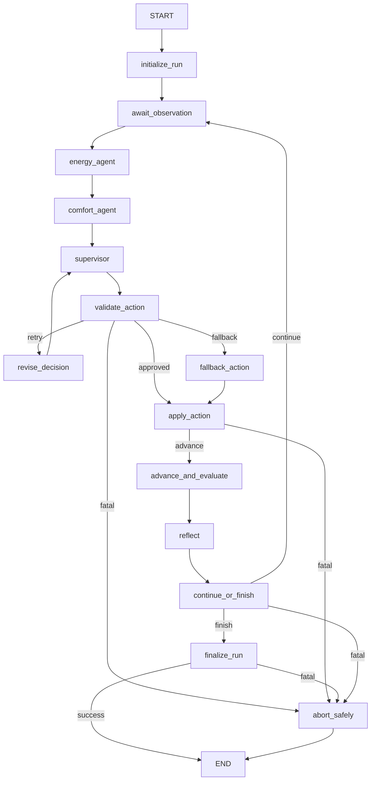

# AGT-001 LangGraph State Machine

## Purpose and boundary

AGT-001 represents the control lifecycle as a typed LangGraph process. It does not call
EnergyPlus, FastMCP, or Qwen directly. Those operations are supplied later through the
`GraphRuntime` protocol, which makes every route testable with deterministic fakes.

LangGraph is pinned to `1.2.9`. The graph uses `InMemorySaver` for same-process
checkpoint inspection and resume only. It is not restart-durable and must not be
presented as a database or recovery mechanism across process termination.

## Exact topology



The graph contains 14 named nodes and 22 possible edges. No node has a LangGraph
`RetryPolicy`. In particular, `apply_action` is invoked once and routes directly to
`abort_safely` if it fails. Finalization is also single-attempt: success reaches `END`,
while every expected, unexpected, or summary-contract failure reaches `abort_safely`
before `END`.

## State and runtime contracts

`RunState` is a `TypedDict` checkpoint contract. Existing Observation, LLM advisory,
control proposal, validation, and fallback values remain frozen strict Pydantic records.
AGT-001 adds frozen strict records for:

- authorized and applied actions;
- evaluation and reflection;
- normalized graph errors;
- final run summaries;
- compact dashboard events.

All graph records reject extra fields and non-finite numeric values. Authorized setpoints
are restricted to `22..28 degC`, and energy/comfort evidence is required and capped at
512 characters.

Run and decision identity uses one shared contract:

```text
^[A-Za-z0-9][A-Za-z0-9._-]{0,127}$
```

Whitespace, control characters, path syntax, oversize content, and common secret,
token, password, prompt, or raw-output markers are rejected rather than truncated.
Observation timestamps are nonblank and bounded because EnergyPlus also uses a
documented simulated-time form. Dashboard event timestamps are stricter UTC `Z`
timestamps.

Every node receives the current state and returns a partial update. Runtime dependencies
receive `GraphStateView`, an immutable normalized snapshot; no mutable module-level state
or service singleton is used. Checkpoint serialization explicitly allowlists only the
project record classes required by this graph.

Energy, Comfort, and Supervisor runtime returns are immediately round-tripped through
their concrete `model_dump()` and typed `model_validate()` contracts before any data
field is accessed or any value is returned to LangGraph. Missing/unchecked fields,
foreign objects, serialization failures, and any ordinary `Exception` during advisory
normalization become the same redacted `GRAPH_CONTRACT_ERROR`. `BaseException` classes
used for process cancellation are deliberately not swallowed.

## Deterministic safety invariants

The graph fails closed before recording success when:

- an observation has a different run ID;
- an observation run/decision identity is hostile, malformed, or unbounded;
- an observation sequence is non-positive or not strictly newer;
- graph-state run ID differs from LangGraph's injected configurable `thread_id`;
- current observation run/decision/sequence differs from the last retained accepted
  observation;
- a restored proposal run, decision, or sequence differs from graph/current observation;
- a restored action run, decision, or sequence differs from graph/current observation;
- a validation record contradicts its approved flag, reason, emergency state, exact
  setpoint, bounds, or nonempty evidence;
- an approved validation does not bind the exact proposed setpoint;
- a fallback setpoint is non-finite or outside `22..28 degC`;
- an applied result differs from the exact authorized action;
- evaluation or reflection uses a different decision ID;
- a final summary has a different run ID, completion count, or status.

`ValidationResult` also enforces self-consistency at construction: an approval requires
reason `APPROVED`, a non-emergency bounded setpoint, and evidence; a rejection cannot
claim `APPROVED` or carry a validated setpoint. The graph independently revalidates the
record to defend against unchecked construction and corrupted checkpoints.

Every internal ControlProposal, fallback, GraphAction, AppliedAction, Evaluation,
Reflection, and RunSummary construction/revalidation is inside a protected node
boundary that contains any ordinary `Exception`. Contract errors become generic
`GRAPH_CONTRACT_ERROR` state; raw values and Pydantic diagnostics are discarded.

Expected adapter failures become a bounded `GraphError` and follow a fatal route.
Unexpected exception details are not checkpointed; they become the generic
`UNEXPECTED_NODE_ERROR` message. This prevents prompts, raw provider output, exception
arguments, and tracebacks from leaking into graph state or dashboard events.

## Retry and recursion budgets

`MAX_REVISIONS` is exactly two. A rejected initial proposal follows:

```text
validation 1 -> revision 1 -> validation 2 -> revision 2 -> validation 3 -> fallback
```

These are semantic graph transitions, not exception retries. Actuation is never
automatically retried.

The recursion limit is derived as:

```text
4 fixed run nodes + max_decisions * 16 worst-case nodes per decision
```

The value is passed in each run configuration and is never LangGraph's default `25`.
If LangGraph still raises `GraphRecursionError`, the runner creates a redacted fatal
record, calls cleanup once, checkpoints the controlled failed state, and returns it.

## Checkpoint and runner API

Each initial invocation requires a `GraphRunInput` containing a unique `run_id` and
positive `max_decisions`. The run ID is used unchanged as LangGraph's configurable
`thread_id`. A run ID cannot be started twice in one runner.

LangGraph injects `RunnableConfig` into validation, fallback authorization, and apply
nodes. Those nodes bind mutable state back to `configurable.thread_id` and to
`recent_observations[-1]`, which is the retained observation accepted by
`await_observation`. This detects both single-field and coordinated mutation of current
run, decision, or sequence values.

Trust boundary: `InMemorySaver` is an in-process test/runtime checkpoint, not a
tamper-proof ledger. AGT-001 detects changes to mutable current state while the retained
accepted observation history and configured thread ID remain trustworthy. If an actor
can maliciously rewrite the accepted history and checkpoint configuration together,
this layer cannot prove provenance; durable authenticated persistence is explicitly
outside AGT-001.

`GraphRunner` exposes:

- `invoke(run)` to start a new isolated run;
- `resume(run_id)` to continue an interrupted same-process checkpoint;
- `get_state(run_id)` to inspect the latest checkpoint;
- `get_state_history(run_id, limit=...)` to inspect checkpoint history;
- `stream(run)` for redacted dashboard-consumable events.

Test-only construction can compile with `interrupt_after` or a deliberately small
recursion limit. Production callers leave both unset.

## Event stream contract

The runner calls LangGraph exactly with:

```python
graph.stream(
    input_state,
    config,
    stream_mode=["updates", "tasks"],
    version="v2",
    durability="sync",
)
```

Raw stream parts are reduced to `GraphEvent` records containing only:

- UTC timestamp;
- run and optional decision ID;
- node name;
- start, finish, update, or error phase;
- names of changed fields;
- an error flag.

Event run/decision IDs share the 128-character allowlist. Node and changed-field names
use a lowercase alphanumeric/underscore allowlist with 64-character limits,
`changed_fields` contains at most 32 items, and UTC timestamps are at most 27
characters. A shared Pydantic `AfterValidator` independently rejects reserved secret,
token, password, prompt, and raw-output markers from both `node` and each
`changed_fields` item. The runtime normalizer retains the same defense and discards
invalid raw task or field names, deterministically sorts the retained names, and passes
only the first 32 into the event contract. This keeps updates with 33 or more otherwise
valid field names bounded without relaxing direct `GraphEvent` validation. A hostile
observation identity is rejected before it becomes current state, so subsequent error
events carry no hostile identifier.

Events never contain full state, observations, setpoints, evidence text, prompts, raw
model output, task inputs/results, debug payloads, or tracebacks. MET-001 may persist
these compact events to JSONL without changing graph behavior.

## AGT-002 integration

AGT-002 should implement `GraphRuntime` by composing the already verified LLM provider,
deterministic control policy, and FastMCP client. The runtime must preserve the identity
checks above and must not give any LLM role direct MCP, SimulationSession, or actuator
access. Provider failure should raise `ExpectedGraphError`; deterministic fallback
remains the only route after two rejected revisions.

## Verification

`tests/test_graph_workflow.py` uses no EnergyPlus, Ollama, or network service. It covers:

- exact node/edge topology and absence of apply retry policy;
- event normalization for 0, 1, 32, 33, and 40 valid changed fields, deterministic
  sorting/first-32 slicing, and mixed invalid-field filtering;
- approved, one-revision, two-revision, and retries-exhausted paths;
- provider, validation, and apply fatal paths;
- continue and finish behavior;
- recursion exhaustion cleanup;
- checkpoint isolation, resume, and history;
- v2 event consumption and redaction;
- adapter identity mismatches and unexpected-exception redaction;
- expected/unexpected/mismatched finalization with exactly-once cleanup;
- contradictory authorization matrices and protected internal construction;
- empty, foreign, nonserializable, and exception-throwing Energy/Comfort/Supervisor
  returns before checkpointing;
- normal and resumed proposal/action identity mutation matrices;
- coordinated run/decision/sequence mutation at validation and apply, anchored to
  injected thread ID and retained accepted history;
- hostile observation/event strings, secret-marker exclusion, and serialized bounds;
- direct reserved-keyword rejection for event node and changed-field contracts;
- finite/bounded immutable contracts and unique run IDs.

Evidence is recorded in `evidence/agt001/verification.v1.json`.
