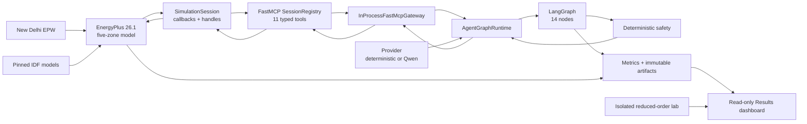

# Eco-Loop Building Agents - Complete Technical Document

Document version: 1.0
Project version: 0.1.0
Participant: Gokulan Malli Jayaprakash (`C10421040`)
Repository: `V:\BMS_simulation`
Implementation status: Complete locally; GitHub publication authorized; deployment and submission remain approval-gated
Last verified: July 26, 2026

## 1. Purpose of this document

This is the single end-to-end technical explanation of Eco-Loop Building Agents. It
combines the software requirements specification, system architecture, technology
choices, physics model, control policy, agent workflow, module responsibilities, data
contracts, persistence model, safety design, testing strategy, measured results,
operating instructions, and known limitations.

After reading it, a developer should understand:

- what problem the system solves and how success is measured;
- which parts are real EnergyPlus control and which parts are demonstrations;
- how an observation becomes a safe physical actuator write;
- what each source module owns and must never own;
- how Energy, Comfort, Supervisor, Safety, Action, and Reflection interact;
- why an LLM cannot directly control the simulated building;
- how runs remain reproducible, immutable, and auditable;
- how to run, test, debug, and extend the project safely.

When this document conflicts with implementation evidence, the precedence is:
`docs/techspec.md` safety rules, typed source contracts, `docs/featurelist.json`, and
then this explanatory document.

## 2. Executive summary

Eco-Loop is a simulation-only autonomous HVAC control proof of concept. EnergyPlus 26.1
acts as a five-zone building digital twin under New Delhi summer weather. Every hour,
the system reads temperatures, occupancy, Fanger PMV/PPD, outdoor temperature, the
cooling schedule, and HVAC electricity. A typed LangGraph process executes distinct
Energy, Comfort, Supervisor, deterministic Safety, Action, Evaluation, and Reflection
stages. A FastMCP boundary is the only route from the graph to the EnergyPlus actuator.

The optimization goal is not simply "use less electricity." It is:

> Minimize HVAC electricity subject to occupied thermal comfort and actuator safety.

The accepted seven-day result uses a reproducible typed deterministic optimizer through
the same LangGraph, validation, FastMCP, EnergyPlus, reflection, and audit path:

| Metric | Fixed baseline | Eco-Loop controlled | Result |
|---|---:|---:|---:|
| HVAC electricity | 40.3305838 kWh | 33.8408481 kWh | 16.09135% saved |
| Cost at INR 8/kWh | INR 322.64 | INR 270.73 | INR 51.92 saved |
| Occupied PMV compliance | 76.00% | 90.63636% | +14.63636 percentage points |
| Emergency PMV samples | 5 | 5 | no regression |
| Applied decisions | not applicable | 168/168 | 100% autonomy |
| Severe EnergyPlus errors | 0 | 0 | passed |

The local Qwen3 4B model is implemented as an optional advisory provider. It produces
strict structured suggestions, but it is never a safety authority. If it is slow,
missing, malformed, semantically wrong, or unavailable, the system falls back to
deterministic PMV-aware control.

## 3. The three system experiences

Understanding these three paths prevents incorrect claims about the project.

### 3.1 Real accepted EnergyPlus experiment

This is the quantitative proof. It runs the controlled EnergyPlus model for 672
15-minute timesteps and makes 168 hourly decisions. It uses:

- real EnergyPlus physics and weather;
- real schedule-actuator writes;
- the production LangGraph;
- the FastMCP tool boundary;
- deterministic validation and server-side reauthorization;
- immutable run artifacts and final baseline comparison.

The accepted run ID is `controlled-run001-optimized-v3`.

### 3.2 Optional local-Qwen control mode

This uses the same real closed-loop architecture, but the Energy, Comfort, and
Supervisor proposals come from local `qwen3:4b-instruct`. Qwen is schema-constrained
and deadline-bounded. Its result remains advisory and may safely fall back. The accepted
16.09% result must not be described as a result generated by Qwen; it was produced by
the deterministic optimizer mode for reproducibility under the CPU deadline.

### 3.3 Live Scenario Lab

This is a separate in-memory dashboard demonstration. It lets a user change outdoor
temperature, occupancy, PMV disturbance, zone temperature, setpoint, and provider mode,
then observe eight LangGraph stages step by step.

The lab:

- uses a reduced-order illustrative temperature/PMV model;
- uses the real typed agent schemas and deterministic safety policy;
- keeps state only in the Streamlit browser session;
- cannot access EnergyPlus, the MCP session registry, real equipment, or accepted-run
  artifact paths;
- must never be presented as accepted quantitative EnergyPlus evidence.

## 4. Problem definition

Conventional building management schedules are often static. They do not respond well
to changing weather, occupancy, current thermal state, or comfort feedback. Raising a
cooling setpoint can save energy but can make warm occupants less comfortable. Lowering
it can improve a hot zone but may waste energy or make another occupied zone cold.

Eco-Loop treats control as a feedback problem:

1. Observe the building.
2. Assess energy opportunity.
3. assess occupant comfort.
4. reconcile the two objectives.
5. validate the proposed action deterministically.
6. independently reauthorize it at the server boundary.
7. apply it to EnergyPlus.
8. measure the next physical state.
9. reflect and continue.

The proof of concept controls one shared cooling schedule for five zones. Because a
single setpoint affects all five zones, simultaneous hot and cold violations create a
real control conflict. The safe response is to hold the last safe value rather than
pretend one shared actuator can satisfy contradictory needs.

## 5. Scope

### 5.1 Included

- EnergyPlus 26.1 five-zone simulation.
- New Delhi Safdarjung TMYx weather.
- Fanger PMV and PPD comfort calculation.
- Fixed-schedule baseline and actively controlled experiment.
- One shared cooling schedule actuator.
- Hourly autonomous decisions over 15-minute physics timesteps.
- Explicit LangGraph state machine.
- Energy, Comfort, Supervisor, Evaluation, and Reflection responsibilities.
- Optional local Qwen structured advice.
- Deterministic safety validation and fallback.
- FastMCP lifecycle and control tools.
- Audit records, metrics, baseline comparison, and immutable artifacts.
- Read-only Streamlit Results dashboard.
- Isolated interactive Live Scenario Lab.
- Automated tests, presentation, PDF, and demo video.

### 5.2 Excluded

- Connection to a physical building or production BMS.
- Direct control of real HVAC equipment.
- Multiple independent zone actuators.
- Carbon optimization or grid-intensity scheduling.
- Automated fault detection and diagnostics.
- Database, cloud service, authentication, multi-user tenancy, or production API.
- Production cybersecurity certification, commissioning, operator override, or
  equipment-specific interlocks.
- Public deployment, publishing, or portal upload without explicit approval.

## 6. Stakeholders and users

| Stakeholder | Need |
|---|---|
| Hackathon judges | A clear, measurable, reproducible comfort-aware energy result |
| Developer/operator | Reliable commands, explicit contracts, diagnostics, and immutable runs |
| Building-control researcher | Inspectable control stages and quantitative EnergyPlus evidence |
| Safety reviewer | Proof that untrusted advice cannot bypass deterministic policy |
| Demo user | A visual dashboard and an adjustable but isolated scenario lab |

## 7. Software requirements specification

### 7.1 Functional requirements

| ID | Requirement | Implemented by |
|---|---|---|
| FR-01 | Prepare a pinned EnergyPlus model for New Delhi and preserve the official source | `simulation/model_prep.py` |
| FR-02 | Produce a reproducible fixed-schedule baseline | `simulation/baseline.py` |
| FR-03 | Read zone temperature, PMV, PPD, occupancy, outdoor temperature, setpoint, and HVAC energy | `simulation/session.py` |
| FR-04 | Apply a validated cooling schedule override during an active run | `SimulationSession` |
| FR-05 | Represent the complete control process as named LangGraph nodes and routes | `graph/workflow.py` |
| FR-06 | Keep Energy, Comfort, and Supervisor as distinct typed advisory roles | `graph/agent_runtime.py`, `llm/schemas.py` |
| FR-07 | Reject unsafe, stale, incomplete, contradictory, or directionally harmful proposals | `control/safety.py` |
| FR-08 | Produce a deterministic bounded fallback for rejected or unavailable advice | `choose_fallback()` |
| FR-09 | Expose lifecycle and control operations through typed FastMCP tools | `mcp_server/server.py` |
| FR-10 | Independently reauthorize the exact action at the server boundary | `SessionRegistry.submit_action()` |
| FR-11 | Correlate every observation, decision, action, and reflection | graph and metrics contracts |
| FR-12 | Compare baseline and controlled energy/comfort using shared calculations | `metrics/evaluation.py` |
| FR-13 | Show judging evidence in a read-only local dashboard | `dashboard/data.py`, `dashboard/app.py` |
| FR-14 | Provide an isolated adjustable multi-agent demonstration | `dashboard/lab.py` |
| FR-15 | Refuse run-ID reuse and preserve previous artifacts | baseline, session, metrics store, integration scripts |

### 7.2 Non-functional requirements

| Quality | Requirement |
|---|---|
| Safety | LLM output never directly reaches an actuator; every physical action is validated twice |
| Reliability | Failures become bounded typed outcomes; waiting callbacks and worker threads terminate safely |
| Reproducibility | Model/weather versions, hashes, run period, timestep, code, and results are recorded |
| Auditability | Run ID, decision ID, sequence, idempotency key, graph event, and action evidence correlate |
| Performance | A decision has a 30-second action window and preserves a 3-second submission margin |
| Data integrity | Runs and final exports are no-overwrite; cross-run or path-escaping data is rejected |
| Explainability | Distinct roles and reflection are visible without treating free-form model text as trusted evidence |
| Maintainability | Simulation, MCP, graph, LLM, safety, metrics, integration, and UI concerns are separated |
| Portability | Primary target is local Windows; Python dependencies are locked; Docker is optional |
| Testability | External services are behind protocols and can be replaced with deterministic fakes |
| Privacy/security | Only loopback Ollama/MCP networking is allowed; credentials and raw prompts are not persisted |

### 7.3 Acceptance criteria

The controlled experiment is accepted only when:

- it completes without an unhandled exception;
- every action is finite, fresh, identity-bound, within `22..28 degC`, and changes by
  no more than `1 degC` under normal control;
- occupied PMV compliance is at least 90%;
- HVAC energy is lower than the fixed baseline;
- emergency violations do not increase;
- EnergyPlus reports zero severe errors;
- audit records prove exact requested, authorized, actuator, shared-schedule, and
  five-zone setpoint agreement.

## 8. Domain concepts

### 8.1 Fanger PMV

Predicted Mean Vote (PMV) estimates average thermal sensation:

- negative PMV means cold;
- zero means neutral;
- positive PMV means warm.

Eco-Loop uses:

- target occupied comfort band: `-0.5 <= PMV <= +0.5`;
- emergency band: `-1.0 <= PMV <= +1.0`;
- values outside the emergency band require deterministic correction.

Only occupied samples count toward the primary comfort KPI. PPD is also recorded as the
predicted percentage dissatisfied, but PMV is the control and acceptance measure.

### 8.2 Setpoint direction

For a cooling setpoint:

- lowering the setpoint increases cooling and generally helps a warm zone;
- raising the setpoint reduces cooling energy and generally helps a cold zone;
- raising it while an occupied zone is warm is unsafe;
- lowering it while an occupied zone is cold is unsafe.

This meaning is implemented in deterministic code, not entrusted to a prompt.

### 8.3 Energy accounting

EnergyPlus reports `Electricity:HVAC` in joules per timestep. The conversion is:

```text
HVAC kWh = sum(unique timestep HVAC joules) / 3,600,000
```

The value is repeated for each zone row, so metrics deduplicate it by timestep sequence
before summing. Cost is illustrative:

```text
cost INR = HVAC kWh * 8
```

### 8.4 Comfort accounting

```text
occupied compliance % =
    compliant occupied zone samples / all occupied zone samples * 100
```

A sample is compliant when PMV is inside `[-0.5, +0.5]`. Violation duration is sample
count multiplied by 15 minutes.

## 9. Technology stack

| Technology | Version/constraint | Responsibility | Selection reason |
|---|---|---|---|
| Python | 3.11-3.12; verified 3.12.1 | Entire application | EnergyPlus API compatibility and fast hackathon delivery |
| EnergyPlus | 26.1.0 | Physics-based digital twin | Industry-grade building simulation and writable actuators |
| LangGraph | 1.2.9 | Explicit state machine | Visible, testable process rather than an opaque loop |
| FastMCP / MCP Python SDK | `mcp>=1.12,<2` | Typed tool and authority boundary | Separates agents from simulation internals |
| Pydantic | `>=2.10,<3` | Strict contracts | Rejects extra, malformed, non-finite, or inconsistent data |
| Ollama | 0.32.4 | Local model service | Local open-source inference |
| Qwen | `qwen3:4b-instruct`, Q4_K_M | Optional advisory reasoning | Small enough for local CPU and structured output |
| Streamlit | `>=1.45,<2` | Local dashboard | Fast, reliable demonstration UI |
| Pandas | `>=2.2,<3` | Dashboard data processing | CSV/JSONL analysis |
| Plotly | `>=6,<7` | Interactive charts | PMV, temperature, setpoint, and energy visualization |
| Pytest / pytest-cov | Pytest 8.x, coverage 6.x | Automated verification | Unit, contract, integration, and UI tests |
| Ruff | 0.11+ | Lint/import quality | Fast static quality gate |
| Pyright | 1.1.400+ strict | Type verification | Protects cross-module contracts |
| uv | locked environment | Dependency resolution | Reproducible installation of 92 packages |
| Git | local repository | Recovery and traceability | Verified checkpoints without automatic publishing |

## 10. System architecture

### 10.1 Component view



### 10.2 Trust hierarchy

1. EnergyPlus is the physical source of truth.
2. Deterministic safety owns PMV meaning and allowable action semantics.
3. FastMCP owns server-side reauthorization immediately before actuation.
4. LangGraph owns process ordering, bounded routes, and state.
5. Qwen or deterministic providers supply advice but not authority.
6. Metrics own evidence calculation and correlation.
7. Streamlit reads completed evidence; it does not control the production loop.

### 10.3 Why double authorization exists

Client-side validation alone is insufficient. A value could be modified between the
validator and the actuator. The graph may validate `24.4 degC`, while a substituted
`25.0 degC` request could still be inside the hard `22..28` range but violate the
one-degree rate limit or comfort direction.

Therefore:

1. the graph validates the proposal;
2. the FastMCP server reconstructs the current observation from its own session;
3. it reruns deterministic validation for advisory actions, or recomputes the exact
   fallback for fallback actions;
4. only an exact match is submitted to `SimulationSession`.

## 11. Real end-to-end closed-loop workflow

### 11.1 Initialization

1. `run_controlled_experiment.py` validates the run ID and selected provider mode.
2. `build_server()` creates the FastMCP server and `SessionRegistry`.
3. `InProcessFastMcpGateway` becomes the graph's only simulation boundary.
4. `AgentGraphRuntime` receives the provider and gateway.
5. `GraphRunner` creates a checkpointed LangGraph thread whose thread ID equals run ID.
6. `initialize_run` starts the active EnergyPlus session.
7. The gateway reads and verifies the locked control constraints.

### 11.2 Observation

At the first 15-minute zone timestep of every simulated hour:

1. EnergyPlus callbacks confirm weather-run mode and that warmup is complete.
2. all required handles are resolved after `api_data_fully_ready`;
3. five zone readings and whole-building values are collected;
4. a unique decision ID and increasing observation sequence are created;
5. the callback publishes an immutable observation;
6. EnergyPlus waits up to 30 seconds for one action.

### 11.3 Advisory roles

The Energy role sees setpoint, outdoor temperature, HVAC energy, occupied PMV range,
and up to 12 trend samples. It proposes a bounded setpoint and expected energy effect.

The Comfort role sees five zone temperatures, PMV, occupancy, target band, and
emergency band. It classifies comfort state, risk, and safe setpoint direction.

The Supervisor sees typed Energy and Comfort outputs, current setpoint, revision count,
and one prior validation reason. It accepts, revises, or abstains.

Arbitrary Energy/Comfort rationale is not forwarded to Supervisor. Trusted evidence is
reconstructed as compact enum/numeric strings such as:

```text
E:reduce:c1.00
C:target_violation:lower
```

### 11.4 Validation and revision

`validate_action` checks identity, freshness, units, five-zone completeness, finite
values, evidence, hard bounds, rate limit, PMV emergency state, shared-zone conflicts,
occupancy, and setpoint direction.

Routes:

- `approved` -> construct advisory action;
- correctable rejection with revision budget -> `revise_decision` -> Supervisor;
- exhausted or non-advisory failure -> deterministic `fallback_action`;
- contract/runtime contradiction -> `abort_safely`.

There are at most two semantic revisions. Revision does not grant more unbounded model
calls when advisory failure has already been latched.

### 11.5 Action submission

The runtime constructs a canonical SHA-256-derived idempotency key from run, decision,
sequence, setpoint, source, evidence, and trigger. It calls the gateway exactly once.
Actuation is never blindly retried.

The returned result must match every request field, report the exact authorized
setpoint and reason, and have `cached=false` for a fresh graph submission. Any mismatch
is fatal.

### 11.6 Physical application

The EnergyPlus callback writes the authorized value through the
`Schedule:Compact / Schedule Value / CLG-SETP-SCH` actuator. The end-of-timestep callback
records:

- requested setpoint;
- direct actuator value after write;
- observed shared schedule value;
- all five observed thermostat cooling setpoints.

This is the proof that an agent-path decision actually changed the simulated building.

### 11.7 Evaluation and reflection

The graph reads the next observation once and caches it. Evaluation calculates:

- sample-to-sample HVAC energy delta;
- percentage of occupied zones inside the PMV target;
- whether all occupied PMV values remain inside the emergency band.

Reflection compares predicted versus measured energy and comfort outcomes, records match
booleans, and recommends continuation only when measured safety is acceptable.

### 11.8 Completion and cleanup

After 168 decisions or natural simulation completion:

1. the graph stops the session once;
2. reads the final FastMCP summary;
3. checks run identity and applied-action count;
4. persists normalized metrics and comparison;
5. resets the terminal MCP registry;
6. leaves the immutable run directory intact.

Every fatal route goes to `abort_safely`, which performs bounded cleanup exactly once.

## 12. LangGraph state machine

The production graph has 14 named nodes:

| Node | Meaning |
|---|---|
| `initialize_run` | Start the controlled session and runtime context |
| `await_observation` | Obtain and normalize the next fresh building state |
| `energy_agent` | Produce typed energy advice |
| `comfort_agent` | Interpret occupied PMV and risk |
| `supervisor` | Reconcile typed Energy and Comfort outputs |
| `validate_action` | Apply authoritative deterministic policy |
| `revise_decision` | Request a bounded semantic correction |
| `fallback_action` | Produce an exact deterministic safe action |
| `apply_action` | Submit one exact action through MCP |
| `advance_and_evaluate` | Read the measured next state |
| `reflect` | Compare prediction with outcome |
| `continue_or_finish` | Select another decision, finalization, or fatal path |
| `finalize_run` | Verify final status and count |
| `abort_safely` | Stop and record controlled failure |

`RunState` retains current typed outputs plus bounded recent history. Node history is
limited to 32 entries and retained observations to 24. Graph recursion is derived from
the maximum decision count rather than left unlimited. Checkpoints are in-memory and
same-process; durable recovery across process restart is outside this proof of concept.

Graph events expose only bounded allowlisted names, phases, changed-field names, and an
error flag. They exclude prompts, free-form evidence, paths, exception details,
setpoints, tokens, and secret-like identity values.

## 13. Deterministic safety policy

### 13.1 Fixed limits

| Rule | Value |
|---|---:|
| Minimum cooling setpoint | 22 degC |
| Maximum cooling setpoint | 28 degC |
| Normal adjacent action change | at most 1 degC |
| Fallback correction step | 0.5 degC |
| Default safe setpoint | 24 degC |
| Occupied PMV target | -0.5 to +0.5 |
| Emergency PMV band | -1.0 to +1.0 |

### 13.2 Validation order

1. Match run ID and decision ID.
2. Match observation sequence and freshness.
3. Require explicit `degC`, `dimensionless`, and `people` units.
4. Require exactly the expected five unique zones.
5. Require temperature, PMV, occupancy, and current setpoint values.
6. Reject non-finite or negative occupancy values.
7. Require separate nonblank Energy and Comfort evidence.
8. Enforce hard setpoint bounds.
9. Detect simultaneous occupied hot and cold conflict.
10. Route emergency PMV to deterministic fallback.
11. Enforce one-degree rate limit.
12. Require correction for occupied hot/cold target violations.
13. Prevent cooling increase when unoccupied.
14. Reject a direction that moves occupied PMV away from neutral.

### 13.3 Fallback behavior

| Condition | Fallback |
|---|---|
| Invalid/stale data | Hold last safe value, or 24 degC if unavailable |
| Simultaneous hot and cold zones | Hold last safe shared setpoint |
| Occupied warm | Lower by 0.5 degC within bounds |
| Occupied cold | Raise by 0.5 degC within bounds |
| Occupied and comfortable | Hold |
| Unoccupied | Raise toward setback by at most 1 degC |

## 14. Deadline and failure behavior

Each observation receives one 30-second monotonic action deadline:

| Boundary | Required time remaining |
|---|---:|
| Before Energy role | 29 seconds |
| Before Comfort role | 20 seconds |
| Before Supervisor role | 11 seconds |
| Before MCP submit | 3 seconds |

Exactly 3.000 seconds permits submit; 2.999 seconds does not call the gateway. If a role
cannot start within its reserve, remaining inference is skipped and deterministic
fallback takes ownership.

Expected model statuses are `success`, `timeout`, `unavailable`, `model_missing`, and
`malformed`. Any non-success latches the current decision into fallback. The system does
not wait for late advice and does not retry an action after the observation may be stale.

## 15. EnergyPlus model and experiment

### 15.1 Model provenance

The source is the official EnergyPlus 26.1 `5ZoneAirCooled.idf`. Its expected source
SHA-256 and byte length are hard-coded in `model_prep.py`. Preparation fails if the
source differs.

Artifacts:

- `models/5ZoneAirCooled.official.idf`: untouched source copy;
- `models/5ZoneAirCooled.baseline.v1.idf`: fixed schedule;
- `models/5ZoneAirCooled.controlled.v1.idf`: runtime actuation;
- `models/model-manifest.v1.json`: provenance and assumptions.

Baseline and controlled models contain the same EnergyPlus objects. Only the leading
mode comment differs, so the runtime controller is the experimental variable.

### 15.2 Weather and timing

- Location: New Delhi Safdarjung Airport.
- Latitude/longitude: `28.58860`, `77.22220`.
- Time zone: UTC+5:30.
- Elevation: 214.9 m.
- Weather: TMYx 2011-2025.
- Experiment: May 23-29.
- Physics timestep: 15 minutes.
- Expected timesteps: 672.
- Control boundary: hourly.
- Expected decisions: 168.

### 15.3 Comfort configuration

All five `People` objects use the Fanger model with:

- work efficiency `0.0`;
- summer clothing `0.50 clo`;
- air velocity `0.15 m/s`;
- original activity and occupancy schedules.

### 15.4 Required outputs and actuator

The model requests zone air temperature, Fanger PMV, Fanger PPD, people count, outdoor
dry-bulb, thermostat cooling setpoint, shared schedule value, and
`Electricity:HVAC`.

The exact actuator is:

```text
Component type: Schedule:Compact
Control type: Schedule Value
Key: CLG-SETP-SCH
```

A missing handle (`-1`) is fatal and produces API dictionary and handle diagnostics.

## 16. FastMCP tool boundary

`SessionRegistry` owns at most one active `SimulationSession`. The server exposes 11
typed tools:

| Tool | Purpose |
|---|---|
| `start_simulation` | Start one bounded controlled run |
| `await_observation` | Wait for the next fresh hourly observation |
| `latest_observation` | Read the current observation |
| `get_recent_trend` | Return up to a bounded sample count |
| `get_control_constraints` | Return locked units and safety limits |
| `submit_action` | Reauthorize and submit one exact idempotent action |
| `get_session_status` | Read lifecycle state |
| `inspect_simulation_errors` | Return normalized warning/severe information |
| `stop_simulation` | Bounded shutdown |
| `reset_simulation` | Clear only a terminal session |
| `get_run_summary` | Return final session counts and latest physical values |

Responses are structured as success data or a normalized `ToolError`; raw exceptions
do not cross the boundary. Default transport is stdio. Optional HTTP transports bind to
`127.0.0.1`.

Idempotency semantics:

- exact replay returns cached success without another physical write;
- reuse of a key with changed identity, source, value, evidence, or trigger is rejected;
- stale or duplicate decisions cannot reach the actuator.

## 17. Provider modes

### 17.1 Deterministic optimizer

`DeterministicOptimizationProvider` implements the same Energy, Comfort, and Supervisor
schemas without inference latency. Its energy target is `25.5 degC`, approached by at
most `1 degC` per decision. Comfort logic classifies PMV, and Supervisor proposes the
typed energy setpoint. All output still passes graph validation and MCP
reauthorization.

This mode produced the accepted run.

### 17.2 Local Qwen

`StructuredAdvisoryProvider` uses an `OllamaChatClient` over loopback only:

- primary model: `qwen3:4b-instruct`;
- optional fallback: `qwen3:1.7b` if already installed;
- temperature: 0;
- seed: 0;
- maximum output: 64 tokens;
- attempt timeout: 8 seconds in production;
- prompt maximum: 1,200 characters;
- structured JSON schema;
- inference serialized by a global lock.

Ordinary provider calls allow one schema correction and at most three total attempts.
Deadline-bound graph calls cache model selection and permit one chat only. No model is
automatically pulled during control.

### 17.3 Deterministic fallback provider

This provider deliberately reports advice unavailable. It is useful for proving that
the graph and physical loop remain safe when no LLM participates.

## 18. Detailed module guide

### 18.1 `src/bms_agent/cli.py`

Owns the command-line interface. `doctor` discovers Python, Git, Docker, EnergyPlus,
EnergyPlus resources, New Delhi weather, Ollama, and configured model availability
without modifying the machine. `run-baseline` resolves inputs and runs the fixed
baseline. It must not contain graph or actuation policy.

### 18.2 `src/bms_agent/simulation/model_prep.py`

Performs a deterministic transformation of one pinned official IDF. It changes site,
run period, design days, People/Fanger fields, output requests, and EMS actuator
dictionary reporting. Unique text markers and hashes prevent accidental model drift.

### 18.3 `src/bms_agent/simulation/baseline.py`

Runs EnergyPlus as an isolated subprocess, stages an IDF into a unique run directory,
normalizes `eplusout.csv`, calculates baseline energy and comfort, writes metadata,
observations, and summary, and compares repeated summaries. It detects missing output,
non-finite values, severe errors, wrong timestep counts, and no-overwrite violations.

### 18.4 `src/bms_agent/simulation/session.py`

Wraps the EnergyPlus Python Runtime and Data Transfer APIs. It owns one API state,
worker thread, callbacks, handles, condition-protected observation/action bridge,
bounded cancellation, result persistence, and state deletion. It is the lowest-level
physical actuation component and accepts only fresh finite bounded actions.

### 18.5 `src/bms_agent/control/safety.py`

Defines strict observation, proposal, validation, and fallback contracts. It implements
all hard comfort/action semantics. This module is independent of LangGraph, MCP,
EnergyPlus, Ollama, and Streamlit, which makes the safety policy reusable and directly
testable.

### 18.6 `src/bms_agent/mcp_server/server.py`

Defines FastMCP request/response schemas, `SessionRegistry`, normalized errors, audit,
one-session ownership, trend buffering, locked constraints, action reauthorization,
idempotency, lifecycle, and the 11 registered tools. It is the physical trust boundary.

### 18.7 `src/bms_agent/llm/client.py`

Defines a model-independent synchronous chat protocol and normalized timeout,
unavailable, and missing-model errors. It contains no Ollama-specific logic.

### 18.8 `src/bms_agent/llm/ollama_client.py`

Implements the chat protocol with Ollama. It rejects non-loopback hosts, embedded
credentials, paths, queries, and fragments. It maps library/network exceptions into
safe provider errors.

### 18.9 `src/bms_agent/llm/schemas.py`

Defines immutable typed outputs:

- `EnergyProposal`;
- `ComfortAssessment`;
- `SupervisorDecision`;
- provider status/result metadata.

The Supervisor's compact wire aliases improve reliability within the 64-token limit.

### 18.10 `src/bms_agent/llm/provider.py`

Owns model selection, structured requests, attempt limits, optional correction,
deadline-bound behavior, sequential inference, and compact attempt audit. Audit records
contain timing/token counts and outcomes, not prompts or model thinking.

### 18.11 `src/bms_agent/graph/agent_contracts.py`

Defines role-specific input contracts and the narrow `McpGateway` protocol. These
contracts ensure agents see only bounded information and cannot access a
`SimulationSession`.

### 18.12 `src/bms_agent/graph/prompts.py`

Pure prompt builders over allowlisted typed inputs. Prompts define PMV sign, units, and
required schema, remain below 1,200 characters, and exclude identifiers, timestamps,
paths, exceptions, raw evidence, and arbitrary prior rationale.

### 18.13 `src/bms_agent/graph/state.py`

Defines graph state, actions, applied actions, evaluation, reflection, errors, summary,
events, and immutable state views. Strict Pydantic contracts reject extra fields and
non-finite values at boundaries.

### 18.14 `src/bms_agent/graph/runtime.py`

Defines the dependency-injected `GraphRuntime` protocol used by nodes. This separates
process topology from concrete services and enables fake-first testing.

### 18.15 `src/bms_agent/graph/workflow.py`

Builds the 14-node LangGraph, routing logic, checkpoint handling, identity anchoring,
bounded history, recursion budget, redacted event stream, safe normalization of every
runtime return, and fatal cleanup.

### 18.16 `src/bms_agent/graph/agent_runtime.py`

Implements `GraphRuntime` by composing advisory provider, deterministic policy, and MCP
gateway. It owns deadlines, role execution, canonical evidence, validation, exact
idempotency, single-submit verification, evaluation, reflection, finalization, and
abort behavior.

### 18.17 `src/bms_agent/integration/gateway.py`

Calls registered FastMCP tools through the tool dispatcher and converts their output
into graph contracts. It validates locked constraints, allowlists server error codes,
normalizes observations/trends, and hides MCP transport details from agents.

### 18.18 `src/bms_agent/integration/runner.py`

Selects deterministic optimizer, deterministic failure, supplied provider, or local
Qwen mode; assembles gateway, runtime, and graph; executes the complete loop; resets the
terminal session; and returns normalized integration evidence.

### 18.19 `src/bms_agent/integration/artifacts.py`

Converts a completed graph and raw EnergyPlus output into shared metrics contracts. It
creates decision and graph audit records, calculates controlled and baseline summaries,
writes immutable exports, and creates the comparison.

### 18.20 `src/bms_agent/metrics/contracts.py`

Defines run metadata, metric samples, decision/graph/run audit records, energy, comfort,
decision, reliability, run summary, and comparison schemas. Every persisted record has
schema version, run ID, and UTC timestamp.

### 18.21 `src/bms_agent/metrics/evaluation.py`

Implements deterministic calculations shared by baseline and controlled runs. It
deduplicates repeated whole-building energy, calculates comfort and reliability, checks
decision-to-observation correlation, and refuses ghost or cross-run evidence.

### 18.22 `src/bms_agent/metrics/store.py`

Provides run-contained append-only JSONL and atomic no-overwrite CSV/JSON exports.
Identity and resolved-path checks prevent traversal or cross-run contamination.

### 18.23 `src/bms_agent/dashboard/data.py`

Discovers only completed contained runs, validates typed summaries/comparisons, loads
required evidence read-only, reconstructs safe role summaries, and joins decision/action
records with reflection timestamps.

### 18.24 `src/bms_agent/dashboard/app.py`

Renders the Results and Live Scenario Lab views. Results show energy, savings, cost,
PMV, temperature, setpoint, cumulative energy, latest graph node, structured roles,
and decision/reflection chronology. It has no production control buttons.

### 18.25 `src/bms_agent/dashboard/lab.py`

Implements an isolated eight-node LangGraph:
Observe -> Energy -> Comfort -> Supervisor -> Safety -> Action -> Simulate ->
Reflection. It uses an illustrative reduced-order PMV/temperature response and writes
no project files.

### 18.26 Scripts

- `scripts/run_controlled_experiment.py`: production experiment entry point.
- `scripts/run_session_smoke.py`: one-day real actuator proof.
- `scripts/validate_sim001.ps1`: model/output/actuator preparation validation.

### 18.27 Package interface files

- `src/bms_agent/__init__.py` exposes package metadata.
- `src/bms_agent/__main__.py` delegates `python -m bms_agent` to the CLI entry point.
- Subpackage `__init__.py` files intentionally re-export their supported public
  contracts so callers do not depend on internal file layout.
- `src/bms_agent/py.typed` declares that the installed package supplies inline type
  information to static type checkers.

## 19. Data model and artifacts

### 19.1 Identity model

- `run_id` identifies one immutable experiment.
- `decision_id` identifies one hourly control decision.
- `observation_sequence` binds a decision to the exact observation.
- `idempotency_key` binds the exact action payload.
- UTC timestamps order audit events.

Identifiers are length-bounded and allowlisted. Secret-like markers, control
characters, whitespace payloads, and path-shaped values are rejected.

### 19.2 Run directory

Typical `runs/<run_id>/` contents include:

```text
input.idf
eplusout.*
api-data.csv
handle-diagnostics.json
actions.jsonl
session-result.json
normalized-run-metadata.jsonl
normalized-metrics.jsonl
normalized-decisions.jsonl
normalized-graph-events.jsonl
normalized-run-events.jsonl
observations.csv
summary.json
comparison.csv
```

Large raw runs are ignored by Git. Compact accepted evidence is curated under
`artifacts/accepted-run/`, and feature verification records are under `evidence/`.

### 19.3 No-overwrite guarantees

- run directories use `mkdir(exist_ok=False)`;
- staged IDFs are hash-verified;
- final metrics exports use atomic create semantics;
- duplicate controlled normalization is rejected before the first write;
- accepted and failed historical runs are preserved.

## 20. Dashboard behavior

### 20.1 Results view

The Results view loads only completed, contained, typed artifacts. It displays:

- controlled HVAC kWh and savings percentage;
- energy and cost saved;
- occupied PMV compliance and improvement;
- rejected actions and fallback count;
- run status and latest graph node;
- five-zone PMV with shaded target band;
- zone temperature and applied schedule;
- cumulative baseline versus controlled energy;
- latest Energy, Comfort, Supervisor, and Reflection output;
- chronological decision, action, and reflection evidence.

If required data is invalid or missing, the dashboard shows a safe error instead of
guessing.

### 20.2 Live Scenario Lab

Inputs are bounded sliders and presets. Each cycle preserves only post-zone
temperatures in Streamlit session state. The reduced-order model estimates PMV from
zone temperature plus disturbance and estimates illustrative HVAC energy. All results
are labeled illustrative.

Provider choices:

- deterministic fast demo;
- local Qwen 4B;
- simulated LLM failure.

In every case, deterministic safety owns the applied setpoint.

## 21. Error handling and recovery

| Failure | Behavior |
|---|---|
| Model/weather missing | Refuse start with configuration error |
| Run ID already exists | Refuse overwrite |
| EnergyPlus handle missing | Write diagnostics, stop, release waiters, delete state |
| EnergyPlus severe/fatal error | Mark failed and preserve raw diagnostics |
| Observation timeout | Fail, except verified natural terminal completion |
| Stale/duplicate action | Reject with zero write |
| LLM timeout/unavailable/malformed | Latch deterministic fallback |
| Unsafe proposal | Reject/revise, then fallback if necessary |
| MCP response mismatch | Fatal cleanup; no second submit |
| Dashboard malformed input | Show safe read-only error |
| Graph recursion exhausted | Record bounded error and abort safely |
| Finalization failure | Route to exactly-once safe cleanup |

## 22. Testing strategy

The test suite contains 377 tests with 90.47% branch coverage. Ruff is clean and strict
Pyright reports zero errors.

| Test file | Main responsibility |
|---|---|
| `test_model_prep.py` | pinned source, transformations, Fanger/output/actuator setup |
| `test_baseline.py` | normalization, calculations, repeatability, isolation, failures |
| `test_session.py` | callbacks, handles, action freshness, lifecycle, real actuator |
| `test_mcp_server.py` | tool schemas, lifecycle, idempotency, reauthorization |
| `test_control_safety.py` | every validation reason, boundary, fallback, units |
| `test_llm_provider.py` | model selection, schema parsing, corrections, timeouts, audit |
| `test_agent_prompts.py` | prompt size, PMV meaning, allowlisting, rationale isolation |
| `test_graph_workflow.py` | all graph routes, identity binding, cleanup, redaction |
| `test_agent_runtime.py` | deadlines, provider failures, gateway matching, reflection |
| `test_integration_gateway.py` | concrete FastMCP transport and controlled lifecycle |
| `test_metrics.py` | energy/comfort math, correlation, atomic persistence |
| `test_dashboard.py` | contained read-only loading and Streamlit rendering |
| `test_live_lab.py` | presets, state, fallback, isolation, unsafe advice |
| `test_cli.py` | diagnostics and safe command behavior |

Testing layers:

1. pure contract and unit tests;
2. fake-first graph and provider failure matrices;
3. FastMCP contract tests;
4. real one-day EnergyPlus actuator smoke;
5. baseline repeatability and concurrent isolation;
6. complete seven-day controlled run;
7. dashboard AppTest and browser validation;
8. unattended full rehearsal and artifact hash checks.

## 23. Safety findings that shaped the architecture

Independent testing found and resolved material issues:

- incorrect LLM PMV semantics;
- local inference latency;
- concurrent EnergyPlus sidecar collision;
- action substitution after client validation;
- silently defaulted units;
- unreliable Supervisor schema;
- finalization without cleanup;
- contradictory validation records;
- malformed runtime contracts escaping the graph;
- checkpoint identity mutation;
- oversized or secret-like event identities;
- sequential inference exceeding action time;
- graph event cardinality overflow;
- gateway authorization metadata mismatch;
- untrusted rationale forwarded between roles;
- audit decision/observation sequence mismatch;
- out-of-policy pre-control schedule values;
- natural terminal observation timeout;
- misleading persistence, lifecycle, and reliability evidence.

The detailed append-only record is `docs/safety-log.md`.

## 24. Setup and operation

### 24.1 Install

```powershell
cd V:\BMS_simulation
uv sync --locked --all-extras
Copy-Item .env.example .env
```

Place the verified New Delhi `.epw`, `.ddy`, and `.stat` files in `weather/`.

### 24.2 Diagnose

```powershell
.\.venv\Scripts\python.exe -m bms_agent.cli doctor --json
```

### 24.3 Prepare model

```powershell
.\.venv\Scripts\python.exe -m bms_agent.simulation.model_prep
```

### 24.4 Run baseline

```powershell
.\.venv\Scripts\python.exe -m bms_agent.cli run-baseline --json
```

### 24.5 Run controlled experiment

```powershell
.\.venv\Scripts\python.exe scripts\run_controlled_experiment.py `
  --run-id unique-controlled-run `
  --mode deterministic-optimizer
```

Use `--mode local-llm` to exercise Qwen or `--mode deterministic-fallback` to prove
safe no-advice behavior. Never reuse a run ID.

### 24.6 Open dashboard

```powershell
.\.venv\Scripts\python.exe -m streamlit run src\bms_agent\dashboard\app.py
```

### 24.7 Run quality gates

```powershell
uv lock --check
.\.venv\Scripts\python.exe -m ruff check .
.\.venv\Scripts\python.exe -m pyright
.\.venv\Scripts\python.exe -m pytest -q
```

## 25. Configuration

Important environment variables:

| Variable | Meaning |
|---|---|
| `ENERGYPLUS_HOME` | EnergyPlus installation root |
| `OLLAMA_HOME` | Optional project-local Ollama executable root |
| `OLLAMA_HOST` | Loopback Ollama endpoint |
| `OLLAMA_MODEL` | Primary model tag |
| `OLLAMA_FALLBACK_MODEL` | Already-installed smaller fallback tag |
| `OLLAMA_MODELS` | Project-local Ollama model storage |
| `BMS_LLM_TIMEOUT_SECONDS` | Bounded provider timeout |
| `BMS_LLM_KEEP_ALIVE` | Bounded local model keep-alive |
| `BMS_LLM_AUDIT_PATH` | Provider attempt audit path |
| `BMS_DASHBOARD_RUNS_ROOT` | Optional contained dashboard run root |

No credentials are required for local execution.

## 26. Verified result interpretation

The controlled system used 6.4897357 kWh less HVAC electricity than baseline. At the
illustrative tariff, that is INR 51.92 over the seven-day model period. More importantly,
the energy saving did not come from ignoring occupants: PMV target compliance rose from
76.00% to 90.64%.

There were 30 deterministic fallbacks and 60 revision records. These do not indicate
loss of autonomy. They demonstrate that the autonomous system recognized when a direct
proposal could not safely satisfy the current PMV state and used its designed fallback
route. All 168 decisions still produced an approved action, so autonomy and reliability
were both 100% under the project's definitions.

Five emergency samples remained in both baseline and controlled cases. The controller
did not eliminate every extreme sample, but it introduced no emergency regression and
met the documented acceptance threshold.

## 27. Novelty

- It optimizes energy under comfort constraints rather than treating comfort as a
  dashboard-only metric.
- Multi-agent reasoning is an inspectable typed state machine, not an opaque repeated
  prompt loop.
- It uses two independent deterministic authorization points before actuation.
- Local AI is deadline-aware and can abstain without blocking control.
- Every applied action has identity, sequence, source, reason, and physical readback.
- The demonstration lab is intentionally isolated from the evidence path.
- Adversarial verification materially improved the final architecture.

## 28. Limitations

- Results are specific to the chosen model, weather, schedules, run period, and shared
  setpoint.
- Fanger PMV depends on modeled clothing, activity, air speed, radiant conditions, and
  occupancy assumptions.
- One shared setpoint cannot independently resolve contradictory zone needs.
- The deterministic optimizer target is tuned for this proof of concept and is not a
  general model-predictive controller.
- Qwen reliability and latency vary by hardware; its accepted quantitative benefit is
  not claimed.
- In-memory LangGraph checkpoints do not survive process restart.
- The tariff is illustrative and excludes demand charges or time-of-use pricing.
- The dashboard is local and has no authentication.
- This is not safe for real equipment without commissioning, override, interlocks,
  cybersecurity, and regulatory review.

## 29. Safe extension guide

### 29.1 Add another advisory model

Implement the `ChatClient` or `AdvisoryProvider` protocol. Preserve strict output
schemas, prompt bounds, deadlines, audit redaction, deterministic validation, and
server-side reauthorization.

### 29.2 Add a new agent role

Define a strict input/output contract, keep its authority advisory, add a named graph
node and bounded route, update recursion limits, canonicalize its evidence, and add fake
failure/deadline/contract tests.

### 29.3 Add zone-specific actuation

This is a material architecture change. It requires new EnergyPlus actuator proof,
per-zone conflict policy, MCP contracts, safety limits, metrics, integration tests, and
user approval before implementation.

### 29.4 Add carbon or tariff optimization

Keep energy/comfort calculations unchanged, introduce typed time-varying signals, and
make carbon/cost secondary objectives subject to the same comfort/safety constraints.
Do not claim carbon savings without sourced grid-intensity data.

### 29.5 Connect to a real BMS

Do not reuse this simulation boundary directly. Add equipment-specific command
interlocks, operator override, commissioning, authentication, network security,
rate-of-change limits, watchdogs, fail-safe states, calibrated sensors, and a formal
safety case.

## 30. Repository map

```text
V:\BMS_simulation
|-- src\bms_agent
|   |-- simulation      # model preparation, baseline, live EnergyPlus session
|   |-- control         # deterministic validator and fallback
|   |-- mcp_server      # typed tools and server-side reauthorization
|   |-- llm             # structured advisory provider and Ollama adapter
|   |-- graph           # contracts, prompts, state, workflow, runtime
|   |-- integration     # concrete gateway, runner, artifact normalization
|   |-- metrics         # persisted contracts, calculations, storage
|   |-- dashboard       # read-only results and isolated live lab
|   `-- cli.py
|-- scripts             # controlled run and smoke entry points
|-- tests               # 377 automated tests
|-- models              # pinned official, baseline, and controlled IDFs
|-- weather             # acquired New Delhi files; ignored by Git
|-- runs                # immutable generated experiments; ignored by Git
|-- artifacts           # curated accepted result and demo images
|-- evidence            # feature verification records
|-- docs                # specifications, architecture, safety, delivery status
|-- deliverables        # PPTX, PDF, and MP4
|-- pyproject.toml
|-- uv.lock
`-- README.md
```

## 31. Glossary

| Term | Meaning |
|---|---|
| BMS | Building Management System |
| Digital twin | Software simulation representing a physical building |
| EnergyPlus | Building energy and thermal simulation engine |
| IDF | EnergyPlus Input Data File |
| EPW | EnergyPlus Weather file |
| PMV | Predicted Mean Vote thermal sensation index |
| PPD | Predicted Percentage Dissatisfied |
| Actuator | Writable EnergyPlus control handle |
| LangGraph | Explicit graph-based workflow and state runtime |
| MCP | Model Context Protocol |
| FastMCP | Python framework used to expose typed MCP tools |
| Advisory | May suggest but cannot authorize a physical action |
| Reauthorization | Server independently validates the exact action again |
| Fallback | Deterministic safe action used when advice is rejected/unavailable |
| Idempotency | Same exact request can be replayed without another physical write |
| Reflection | Comparison of predicted and measured post-action outcome |
| Immutable run | A run ID and artifact directory that cannot be overwritten |
| Reduced-order model | Simplified illustrative model, not full EnergyPlus physics |

## 32. Final mental model

Eco-Loop is best understood as layers of decreasing trust:

```text
Qwen/deterministic roles propose
        |
LangGraph orders and records the process
        |
deterministic policy decides what is safe
        |
FastMCP independently decides whether the exact request is still safe
        |
EnergyPlus applies and reveals the physical result
        |
metrics prove energy, comfort, autonomy, and traceability
        |
Streamlit explains completed evidence without controlling it
```

The core engineering achievement is not that an LLM changes a thermostat. It is that an
autonomous, inspectable multi-agent process can optimize a physics-based building while
untrusted advice, stale state, malformed data, timing failure, and substituted actions
remain unable to bypass comfort and actuator safety.
